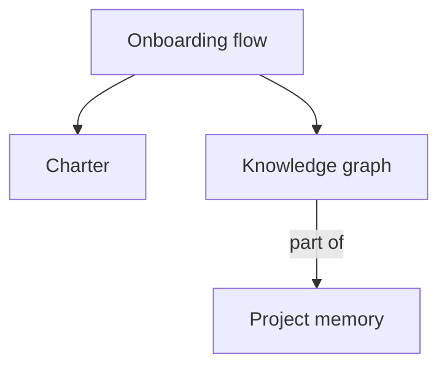

# Knowledge graph (`~/.ai/<project>/knowledge/`)

The knowledge graph is the team's map of **what concepts this codebase has and how they relate** —
so the next feature starts from understanding, not from rediscovery. It captures the durable shape
of the system (domain terms, components, flows, patterns, external dependencies), not the day-to-day
work (that's `decisions/`, `tasks/`, `research/`).

**It is local, like all of `~/.ai/<project>/`.** It lives in the central store outside the repo —
not part of git history. It is *your machine's* understanding of the *shared* code. That's why it can drift: a teammate merges a change
to the code, your local graph still describes the old shape. **Refresh** is how you re-sync.

## Layout

```
~/.ai/<project>/knowledge/
  README.md              how the graph works (human-facing)
  graph.md               the Mermaid relationship diagram + concept index + "last refreshed" line
  archive/               old duplicate/stale concept files moved aside during organize runs
  concepts/
    {slug}.md            one concept per file
```

## What is a concept (and what isn't)

A concept is a *thing worth understanding to work here*:

- **domain term** — a word from the problem space (e.g. "invoice", "tenant", "charter").
- **component** — a module, service, or unit that does a job (e.g. "auth token verifier").
- **flow** — a path through the system (e.g. "onboarding flow", "request → auth → handler").
- **pattern** — a convention used repeatedly (e.g. "one-home-per-artifact", "read-only onboarding").
- **external dependency** — a library/service the system leans on and how it's used.

Not concepts: individual functions, one-off variables, transient tasks, or decisions (link to the
`decisions/` entry instead). Keep the graph to the ~dozens of nodes that actually matter, not
hundreds. If it's not something you'd want a new teammate to understand before touching a feature,
it doesn't belong here.

**A concept must be verifiable in the current code.** The graph records what the system *is*, not
what the team plans to build. A decision (ADR) that is `Proposed` or `Accepted` but not yet
`Implemented` is *intent*, not shape — do not add it as a concept, and do not let its planned
behavior leak into an existing concept file. A decision's content becomes eligible for the graph
only once it is `Implemented` and its code can be cited by `file:line`. See the **decision-and-spec**
skill for the boundary rule.

## Concept file format — `concepts/{slug}.md`

```markdown
# {Concept name}

- **Type:** domain term | component | flow | pattern | external dependency
- **Status:** current | needs-reverification
- **Last verified:** {YYYY-MM-DD} @ {git SHA or branch}

## What it is
One or two plain-language sentences — understandable by someone who wasn't in the room.

## How it works
Behavior and responsibilities, grounded in the code. Reference real locations: `path/to/file.ext:120-160`.
Mark anything you couldn't confirm as inferred or unknown — the graph records evidence, not guesses.

## Relationships
- depends on → [{concept}](./{slug}.md)
- used by → [{concept}](./{slug}.md)
- part of → [{concept}](./{slug}.md)
- related to → [{concept}](./{slug}.md)

## Sources
- `path/to/file.ext:120-160` — what this shows
```

**Relationship vocabulary** (keep it small and directional so the graph stays readable):
`depends on`, `used by`, `part of`, `related to`. Every relationship should point at another
concept file that exists — no dangling links.

## Graph index — `graph.md`

Holds three things: the "last refreshed" provenance line, a Mermaid diagram of the relationships,
and a table indexing every concept file.

````markdown
# Knowledge graph

_Last refreshed: {YYYY-MM-DD} @ {git SHA or branch}_

## Map



## Concepts

| Concept | Type | Status |
|---------|------|--------|
| [Onboarding flow](./concepts/onboarding-flow.md) | flow | current |
| [Charter](./concepts/charter.md) | domain term | current |
````

## Building the graph

1. **Trace, don't guess.** Read the real code (use the **Explore** subagent for breadth). A concept
   named `AuthManager` might not do what the name says — confirm from the code.
2. **Extract concepts, not code.** Capture the ~dozens of things that matter, each with its sources.
3. **Wire the relationships.** A concept in isolation is a note; the value is the edges. For each,
   ask: what does it depend on, what uses it, what is it part of?
4. **Ground every claim.** Every "how it works" line should trace to a `file:line`, or be marked
   inferred/unknown. Stamp `Last verified` with today's date and the current git SHA/branch.
5. **Keep one home.** Don't restate a decision's rationale here — link to the `decisions/` entry.
   The graph says *what a concept is and how it connects*; the why-we-chose-it lives in `decisions/`.
   And only map a decision's outcome once it's `Implemented` — a `Proposed`/`Accepted` decision has
   no code to ground a concept in.

## Refreshing the graph (reconcile against the current code)

Refresh exists because the code is shared and the graph is local. Re-scan the current code, build a
fresh view, and diff it against what's recorded — then sort every difference into one bucket:

- **New** — exists in the code now, not in the graph → add a concept file.
- **Changed** — recorded concept whose sources moved or whose behavior differs → update it, re-stamp
  `Last verified`.
- **Removed** — recorded concept whose code is gone → mark it removed and note what replaced it if
  known. Don't silently delete — a removed concept is information.
- **Conflict** — the record asserts one thing, the code now shows another. **This is the one that
  matters most.** Never overwrite local knowledge to match new code without surfacing the conflict
  to the user first — the discrepancy itself may be a bug a teammate introduced, or a rename you
  should follow. Present it, get the call, then merge.

A decision that has just moved to `Implemented` is a natural refresh trigger: its code is now real,
so re-scan the affected area and fold the resulting concept in as **New** or **Changed**. Conversely,
when a decision moves to `Superseded`, mark any concept it grounded `needs-reverification` — the
code that backed it may have changed.

After reconciling: preserve provenance on untouched nodes, set `Status: needs-reverification` on
anything you couldn't confirm, and update the `graph.md` diagram, index, and "last refreshed" line.

## Organizing the graph (deduplicate and restore one home per concept)

Organize exists because repeated graph runs can create multiple concept files that say the same
thing. It is a cleanup pass over the recorded graph, not a full re-discovery pass.

1. **Inventory first.** Read `graph.md` and all `concepts/*.md`. List each concept's slug, title,
  type, status, sources, relationships, incoming links, and last verified stamp.
2. **Cluster duplicates.** Group exact duplicates, overlapping duplicates, split candidates, and
  ambiguous lookalikes. Similar names are not enough; compare what the files claim and what
  sources they cite.
3. **Pick a canonical home.** Prefer the slug already referenced by `graph.md` or by more incoming
  links; otherwise prefer the clearest name with the strongest source evidence.
4. **Merge unique value only.** Preserve distinct sources, relationships, and verified behavior;
  remove repeated prose and weaker duplicate citations.
5. **Rewrite links.** Update every concept link, the Mermaid diagram, and the index to point to
  canonical concept files. The active graph should have one indexed file per concept.
6. **Archive, don't silently delete.** Move redundant files to
  `~/.ai/<project>/knowledge/archive/{YYYY-MM-DD}/` and prepend an archive header naming the canonical
  replacement and reason. Delete only when the user explicitly asks.
7. **Split when a file holds two concepts.** If one file actually describes multiple concepts,
  create a new concept file for each with its own sources and relationships, rewire links and the
  index, then archive the original with reason `split into {slugs}`.
8. **Leave ambiguity visible.** If two files may or may not be the same concept, do not merge them
  without user confirmation. Mark unresolved concepts `needs-reverification` and record the open
  question in the organize report.

**When two files are the same concept** (safe to merge): they describe the same domain term,
component, flow, pattern, or dependency, and cite the same or overlapping sources. Similar names
alone are not enough, and files of different `Type` that merely relate are *not* duplicates — link
them instead.

**Archive header** — prepend this to every archived file so the trail is readable:

```markdown
> Archived {YYYY-MM-DD} — superseded by [{Canonical concept}](../../concepts/{slug}.md)
> Reason: merged (duplicate) | split into {slugs} | renamed | stale
```

Archived files live under `~/.ai/<project>/knowledge/archive/{YYYY-MM-DD}/`, so the link to the canonical
concept climbs two directories (`../../concepts/`).

After organizing: update `graph.md` with the canonical concept set, stamp the run with today's date
and current git SHA/branch, and report merged, archived, split/renamed, and left-separate groups.

## Ownership

- **researcher (Ada)** extracts concepts and relationships from the code, with evidence and
  confidence — she owns *what the graph says is true*.
- **scribe (Quill)** writes and maintains the concept files and `graph.md`, keeping them plain,
  linked, and current — she owns *the record*.

Both read everything. Everyone else reads the graph at the start of feature work and flags a concept
that looks stale rather than fixing it in passing.
